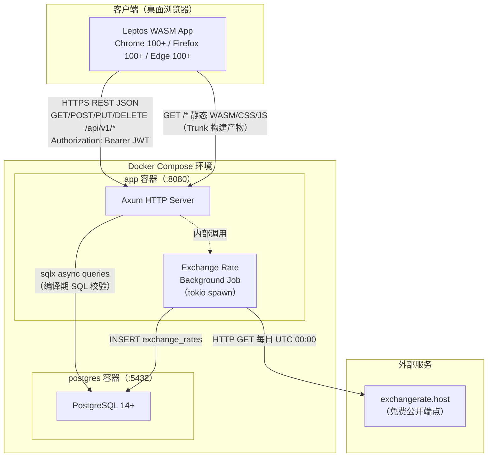
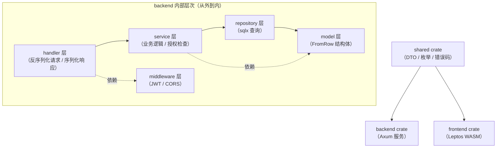
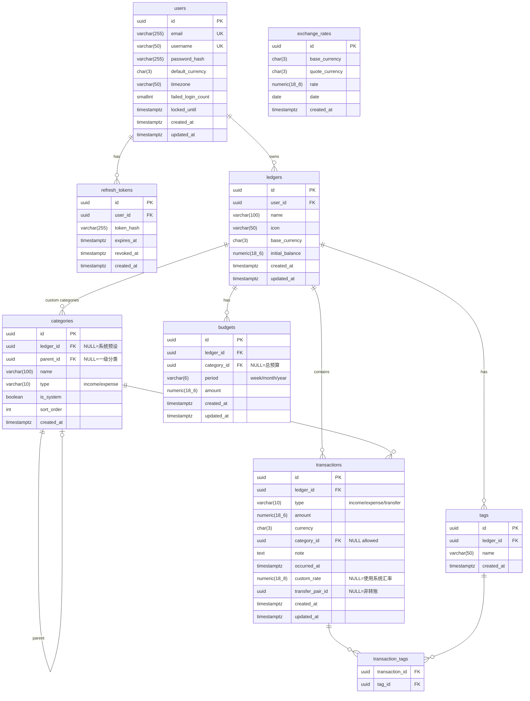
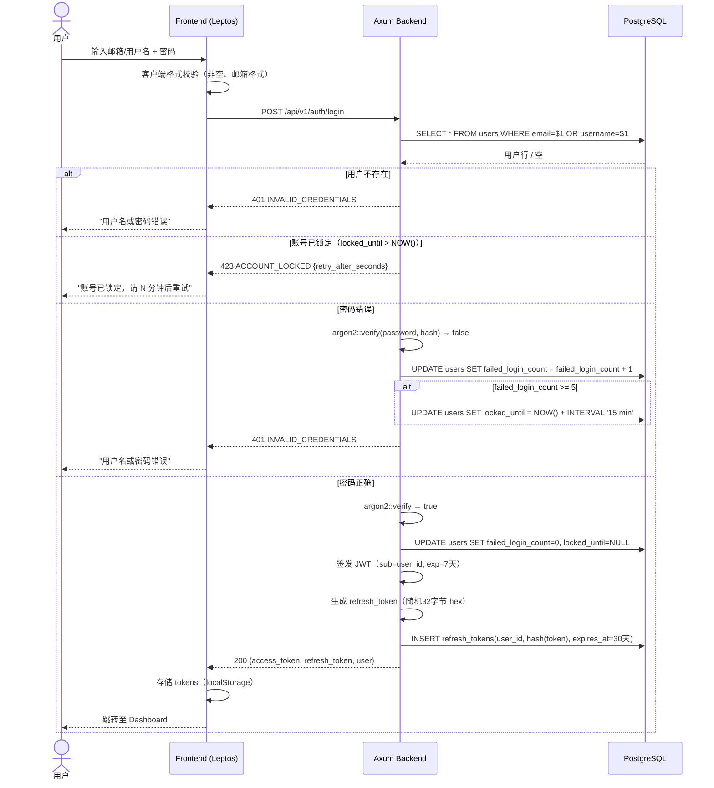
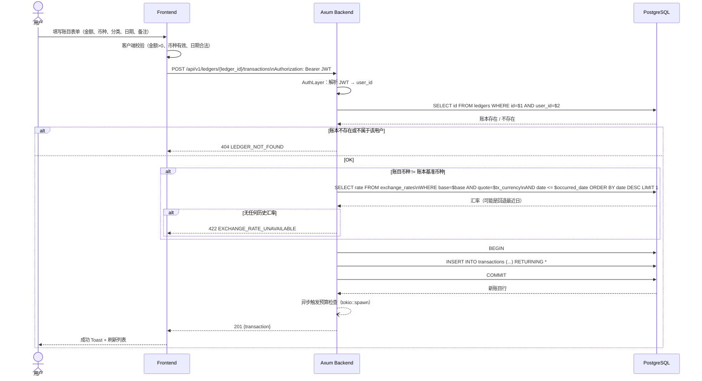
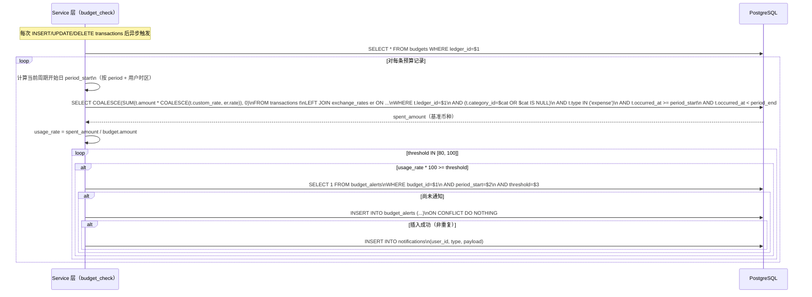
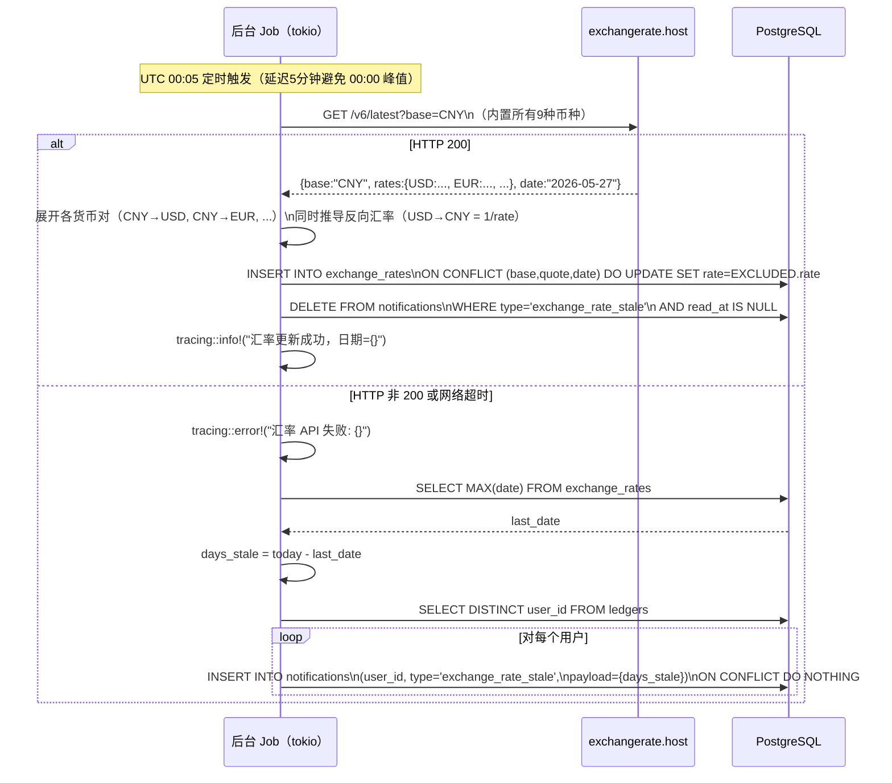
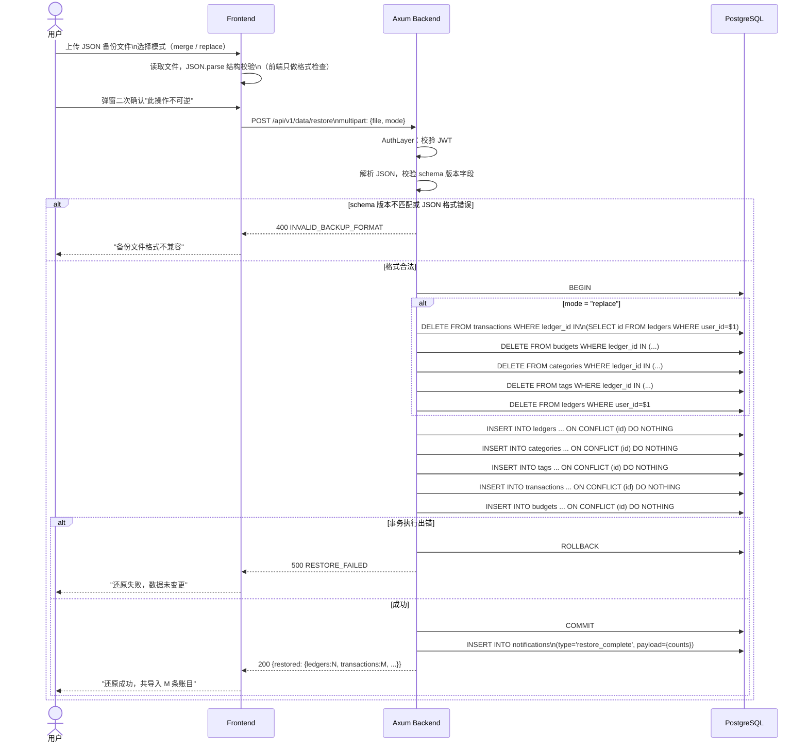
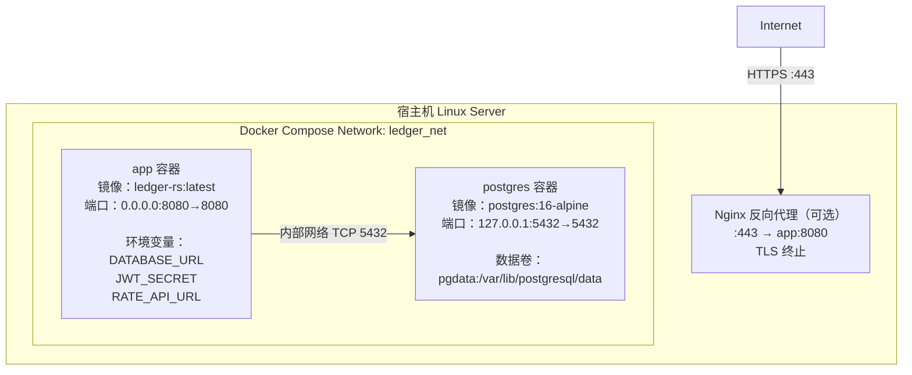

# LedgerRS 系统设计文档

| 文档版本 | v1.0 |
|---------|------|
| 编写日期 | 2026-05-27 |
| 状态 | 与需求文档 v0.1 对齐 |

---

## 目录

1. [系统总体架构](#1-系统总体架构)
2. [模块划分与依赖关系](#2-模块划分与依赖关系)
3. [数据库设计](#3-数据库设计)
4. [关键业务流程时序图](#4-关键业务流程时序图)
5. [API 分层设计](#5-api-分层设计)
6. [错误处理设计](#6-错误处理设计)
7. [鉴权与中间件设计](#7-鉴权与中间件设计)
8. [前端组件树与路由设计](#8-前端组件树与路由设计)
9. [部署架构](#9-部署架构)
10. [技术选型理由](#10-技术选型理由)

---

## 1. 系统总体架构

### 1.1 架构概览

LedgerRS 采用前后端分离的单体部署架构：Leptos 编译为 WASM 静态资源，由 Axum 同一进程服务；后端通过 sqlx 连接 PostgreSQL；一个后台定时任务每日从外部汇率 API 拉取数据。



### 1.2 请求生命周期

```
Browser → HTTPS → Axum Router
                      │
                ┌─────▼──────────────────────────────┐
                │  Tower 中间件栈                      │
                │  ① TraceLayer（请求日志）            │
                │  ② CorsLayer（CORS 头）             │
                │  ③ CompressionLayer（gzip）         │
                │  ④ AuthLayer（JWT 校验，按路由挂载）  │
                └─────┬──────────────────────────────┘
                      │
                 Handler fn
                      │
                 Service（业务逻辑）
                      │
                 Repository（sqlx 查询）
                      │
                 PostgreSQL
```

---

## 2. 模块划分与依赖关系

### 2.1 Cargo Workspace 结构

```
LedgerRS/
├── Cargo.toml                  ← workspace root
├── backend/                    ← Axum HTTP 服务
│   ├── Cargo.toml
│   └── src/
│       ├── main.rs
│       ├── config.rs           ← 环境变量配置（AppConfig）
│       ├── error.rs            ← AppError + IntoResponse
│       ├── router.rs           ← 路由注册总入口
│       ├── openapi.rs          ← utoipa OpenAPI 描述聚合
│       ├── middleware/
│       │   ├── mod.rs
│       │   └── auth.rs         ← JWT 提取与用户注入
│       ├── handler/            ← 8 个模块 handler
│       │   ├── mod.rs
│       │   ├── auth.rs
│       │   ├── ledgers.rs
│       │   ├── transactions.rs
│       │   ├── categories.rs
│       │   ├── tags.rs
│       │   ├── budgets.rs
│       │   ├── exchange_rates.rs
│       │   ├── reports.rs
│       │   └── notifications.rs
│       ├── service/            ← 业务逻辑层
│       │   └── （同 handler 结构）
│       ├── repository/         ← 数据访问层
│       │   └── （同 handler 结构）
│       ├── model/              ← DB 行结构体（sqlx FromRow）
│       │   └── mod.rs
│       └── jobs/
│           └── exchange_rate.rs ← 汇率定时拉取
├── frontend/                   ← Leptos WASM 前端
│   ├── Cargo.toml
│   ├── index.html              ← Trunk 入口
│   └── src/
│       ├── main.rs
│       ├── app.rs              ← 根组件 + 路由
│       ├── api/
│       │   └── client.rs       ← HTTP 客户端（gloo-net）
│       ├── components/         ← 可复用 UI 组件
│       └── pages/              ← 页面级组件
├── shared/                     ← 前后端共享类型
│   ├── Cargo.toml
│   └── src/
│       ├── lib.rs
│       ├── dto/                ← Request/Response DTO
│       ├── types.rs            ← Currency 枚举、Period 枚举等
│       └── error_codes.rs      ← 错误码常量
├── migrations/                 ← sqlx-cli 迁移文件
├── Dockerfile
├── docker-compose.yml
├── .github/workflows/ci.yml
└── README.md
```

### 2.2 Crate 依赖关系



**规则**：
- `handler` 只能调用 `service`，不直接访问 `repository`
- `service` 不能使用 axum 的任何类型（解耦框架依赖）
- `shared` 不能依赖 `backend` 或 `frontend`（无循环）

---

## 3. 数据库设计

### 3.1 设计决策

| 决策 | 说明 |
|------|------|
| 主键全部使用 UUID v4 | 避免 ID 枚举攻击，跨系统合并友好 |
| 时间戳全部使用 `TIMESTAMPTZ` | 统一 UTC 存储，前端按用户时区展示 |
| 金额使用 `NUMERIC(18,6)` | 避免浮点精度损失；6 位小数覆盖日元等整数货币 |
| 汇率使用 `NUMERIC(18,8)` | 汇率精度更高 |
| **全部使用硬删除** | 无 `deleted_at` 字段，删除即物理删除；代码 + 测试简单 |
| 账本基准币种不可修改 | 由 `UPDATE` 语句的 `WHERE` + 应用层拦截双重保证 |

### 3.2 ER 图



### 3.3 完整表结构

#### 3.3.1 `users`

```sql
CREATE TABLE users (
    id                  UUID PRIMARY KEY DEFAULT gen_random_uuid(),
    email               VARCHAR(255) NOT NULL,
    username            VARCHAR(50)  NOT NULL,
    password_hash       VARCHAR(255) NOT NULL,
    default_currency    CHAR(3)      NOT NULL DEFAULT 'CNY',
    timezone            VARCHAR(50)  NOT NULL DEFAULT 'Asia/Shanghai',
    failed_login_count  SMALLINT     NOT NULL DEFAULT 0,
    locked_until        TIMESTAMPTZ,
    created_at          TIMESTAMPTZ  NOT NULL DEFAULT NOW(),
    updated_at          TIMESTAMPTZ  NOT NULL DEFAULT NOW(),
    CONSTRAINT uq_users_email    UNIQUE (email),
    CONSTRAINT uq_users_username UNIQUE (username)
);
CREATE INDEX idx_users_email    ON users (email);
CREATE INDEX idx_users_username ON users (username);
```

#### 3.3.2 `refresh_tokens`

```sql
CREATE TABLE refresh_tokens (
    id          UUID PRIMARY KEY DEFAULT gen_random_uuid(),
    user_id     UUID        NOT NULL REFERENCES users(id) ON DELETE CASCADE,
    token_hash  VARCHAR(255) NOT NULL,
    expires_at  TIMESTAMPTZ NOT NULL,
    revoked_at  TIMESTAMPTZ,
    created_at  TIMESTAMPTZ NOT NULL DEFAULT NOW()
);
CREATE INDEX idx_refresh_tokens_user ON refresh_tokens (user_id, revoked_at);
```

#### 3.3.3 `ledgers`

```sql
CREATE TABLE ledgers (
    id               UUID PRIMARY KEY DEFAULT gen_random_uuid(),
    user_id          UUID          NOT NULL REFERENCES users(id) ON DELETE CASCADE,
    name             VARCHAR(100)  NOT NULL,
    icon             VARCHAR(50)   NOT NULL DEFAULT 'wallet',
    base_currency    CHAR(3)       NOT NULL,
    initial_balance  NUMERIC(18,6) NOT NULL DEFAULT 0,
    created_at       TIMESTAMPTZ   NOT NULL DEFAULT NOW(),
    updated_at       TIMESTAMPTZ   NOT NULL DEFAULT NOW()
);
CREATE INDEX idx_ledgers_user ON ledgers (user_id);
```

注：`base_currency` 创建后不得修改，由应用层在 `PUT /ledgers/:id` handler 中拦截。

#### 3.3.4 `categories`

```sql
CREATE TABLE categories (
    id          UUID PRIMARY KEY DEFAULT gen_random_uuid(),
    ledger_id   UUID         REFERENCES ledgers(id) ON DELETE CASCADE,   -- NULL = 系统预设
    parent_id   UUID         REFERENCES categories(id) ON DELETE CASCADE, -- NULL = 一级
    name        VARCHAR(100) NOT NULL,
    type        VARCHAR(10)  NOT NULL CHECK (type IN ('income', 'expense')),
    is_system   BOOLEAN      NOT NULL DEFAULT FALSE,
    sort_order  INT          NOT NULL DEFAULT 0,
    created_at  TIMESTAMPTZ  NOT NULL DEFAULT NOW()
);
CREATE INDEX idx_categories_ledger ON categories (ledger_id);
CREATE INDEX idx_categories_parent ON categories (parent_id);
```

#### 3.3.5 `tags`

```sql
CREATE TABLE tags (
    id          UUID PRIMARY KEY DEFAULT gen_random_uuid(),
    ledger_id   UUID        NOT NULL REFERENCES ledgers(id) ON DELETE CASCADE,
    name        VARCHAR(50) NOT NULL,
    created_at  TIMESTAMPTZ NOT NULL DEFAULT NOW(),
    CONSTRAINT uq_tags_ledger_name UNIQUE (ledger_id, name)
);
CREATE INDEX idx_tags_ledger ON tags (ledger_id);
```

#### 3.3.6 `transactions`

```sql
CREATE TABLE transactions (
    id               UUID PRIMARY KEY DEFAULT gen_random_uuid(),
    ledger_id        UUID          NOT NULL REFERENCES ledgers(id) ON DELETE CASCADE,
    type             VARCHAR(10)   NOT NULL CHECK (type IN ('income', 'expense', 'transfer')),
    amount           NUMERIC(18,6) NOT NULL CHECK (amount > 0),
    currency         CHAR(3)       NOT NULL,
    category_id      UUID          REFERENCES categories(id) ON DELETE SET NULL,
    note             TEXT,
    occurred_at      TIMESTAMPTZ   NOT NULL,
    custom_rate      NUMERIC(18,8),                    -- 用户手动覆盖汇率（FR-6.5）
    transfer_pair_id UUID,                              -- 转账双方共用同一 UUID
    created_at       TIMESTAMPTZ   NOT NULL DEFAULT NOW(),
    updated_at       TIMESTAMPTZ   NOT NULL DEFAULT NOW()
);
CREATE INDEX idx_transactions_ledger_date ON transactions (ledger_id, occurred_at DESC);
CREATE INDEX idx_transactions_category    ON transactions (category_id);
CREATE INDEX idx_transactions_transfer    ON transactions (transfer_pair_id) WHERE transfer_pair_id IS NOT NULL;
```

**转账设计**：一次转账生成两条 `transactions` 记录，共享同一 `transfer_pair_id`。
- 来源账本的记录：`type='transfer'`，`amount` 为扣减金额
- 目标账本的记录：`type='transfer'`，`amount` 为入账金额（按汇率换算）
- 报表统计时，`type='transfer'` 的记录不计入收支预算

#### 3.3.7 `transaction_tags`

```sql
CREATE TABLE transaction_tags (
    transaction_id UUID NOT NULL REFERENCES transactions(id) ON DELETE CASCADE,
    tag_id         UUID NOT NULL REFERENCES tags(id) ON DELETE CASCADE,
    PRIMARY KEY (transaction_id, tag_id)
);
```

#### 3.3.8 `budgets`

```sql
CREATE TABLE budgets (
    id           UUID PRIMARY KEY DEFAULT gen_random_uuid(),
    ledger_id    UUID         NOT NULL REFERENCES ledgers(id) ON DELETE CASCADE,
    category_id  UUID         REFERENCES categories(id) ON DELETE CASCADE, -- NULL = 总预算
    period       VARCHAR(6)   NOT NULL CHECK (period IN ('week', 'month', 'year')),
    amount       NUMERIC(18,6) NOT NULL CHECK (amount > 0),
    created_at   TIMESTAMPTZ  NOT NULL DEFAULT NOW(),
    updated_at   TIMESTAMPTZ  NOT NULL DEFAULT NOW(),
    CONSTRAINT uq_budget_ledger_cat_period UNIQUE (ledger_id, category_id, period)
);
CREATE INDEX idx_budgets_ledger ON budgets (ledger_id);
```

#### 3.3.9 `exchange_rates`

```sql
CREATE TABLE exchange_rates (
    id             UUID PRIMARY KEY DEFAULT gen_random_uuid(),
    base_currency  CHAR(3)       NOT NULL,
    quote_currency CHAR(3)       NOT NULL,
    rate           NUMERIC(18,8) NOT NULL CHECK (rate > 0),
    date           DATE          NOT NULL,
    created_at     TIMESTAMPTZ   NOT NULL DEFAULT NOW(),
    CONSTRAINT uq_exchange_rate UNIQUE (base_currency, quote_currency, date)
);
CREATE INDEX idx_exchange_rates_lookup
    ON exchange_rates (base_currency, quote_currency, date DESC);
```

注：通知模块已从需求中移除，不建 `notifications` 表。预算超支通过预算列表的使用率字段展示。

---

## 4. 关键业务流程时序图

### 4.1 用户登录



### 4.2 新增账目



### 4.3 预算超支触发通知



### 4.4 汇率每日定时拉取



### 4.5 JSON 全量备份还原



---

## 5. API 分层设计

### 5.1 层次职责

| 层 | 文件位置 | 职责 | 禁止 |
|----|---------|------|------|
| **Router** | `backend/src/router.rs` | 注册路由、挂载中间件、配置 OpenAPI | 业务逻辑 |
| **Handler** | `backend/src/handler/*.rs` | 提取请求（Path/Query/Json）、调用 service、返回响应 | 直接调用 repository、DB 操作 |
| **Service** | `backend/src/service/*.rs` | 业务逻辑、数据校验、权限检查（user_id 隔离）、组合多个 repository 调用、事务管理 | 使用 axum 类型、HTTP 相关概念 |
| **Repository** | `backend/src/repository/*.rs` | sqlx 查询（`query!` / `query_as!`）、返回 model 或 DTO | 业务逻辑、多表事务协调 |
| **Model** | `backend/src/model/*.rs` | `#[derive(sqlx::FromRow)]` 结构体，与 DB 行一一对应 | 业务逻辑 |

### 5.2 典型代码结构示例

```rust
// handler/transactions.rs
pub async fn create_transaction(
    State(state): State<AppState>,
    Extension(user): Extension<AuthUser>,
    Path(ledger_id): Path<Uuid>,
    Json(req): Json<CreateTransactionRequest>,
) -> Result<impl IntoResponse, AppError> {
    let tx = state
        .transaction_service
        .create(user.id, ledger_id, req)
        .await?;
    Ok((StatusCode::CREATED, Json(tx)))
}

// service/transactions.rs
impl TransactionService {
    pub async fn create(
        &self,
        user_id: Uuid,
        ledger_id: Uuid,
        req: CreateTransactionRequest,
    ) -> Result<TransactionResponse, AppError> {
        // 1. 验证 ledger 归属
        self.ledger_repo.get_for_user(ledger_id, user_id).await?;
        // 2. 查汇率
        let rate = self.exchange_rate_repo
            .get_rate(ledger.base_currency, req.currency, req.occurred_at.date())
            .await?;
        // 3. 插入
        let model = self.tx_repo.insert(&req, rate).await?;
        // 4. 异步预算检查
        tokio::spawn(self.budget_service.check_after_transaction(ledger_id));
        Ok(TransactionResponse::from(model))
    }
}

// repository/transactions.rs
impl TransactionRepository {
    pub async fn insert(
        &self,
        req: &CreateTransactionRequest,
        rate: Option<Decimal>,
    ) -> Result<TransactionModel, AppError> {
        let row = sqlx::query_as!(
            TransactionModel,
            r#"INSERT INTO transactions
               (ledger_id, type, amount, currency, category_id, note, occurred_at, custom_rate)
               VALUES ($1, $2, $3, $4, $5, $6, $7, $8)
               RETURNING *"#,
            req.ledger_id,
            req.r#type as _,
            req.amount,
            req.currency,
            req.category_id,
            req.note,
            req.occurred_at,
            req.custom_rate,
        )
        .fetch_one(&self.pool)
        .await?;
        Ok(row)
    }
}
```

### 5.3 AppState 结构

```rust
#[derive(Clone)]
pub struct AppState {
    pub pool: PgPool,
    pub config: Arc<AppConfig>,
    // 可注入各 service（或直接共享 pool）
}
```

---

## 6. 错误处理设计

### 6.1 AppError 定义

```rust
// backend/src/error.rs
#[derive(Debug, thiserror::Error)]
pub enum AppError {
    #[error("Not found: {0}")]
    NotFound(String),

    #[error("Unauthorized")]
    Unauthorized,

    #[error("Forbidden: {0}")]
    Forbidden(String),

    #[error("Validation: {0}")]
    Validation(String),

    #[error("Conflict: {0}")]
    Conflict(String),

    #[error("Account locked")]
    AccountLocked { retry_after_seconds: u64 },

    #[error("Exchange rate unavailable")]
    ExchangeRateUnavailable,

    #[error("Invalid backup format: {0}")]
    InvalidBackupFormat(String),

    #[error("Database error")]
    Database(#[from] sqlx::Error),

    #[error("External API error: {0}")]
    ExternalApi(String),

    #[error("Internal error")]
    Internal(#[from] anyhow::Error),
}
```

### 6.2 HTTP 状态码映射

| AppError 变体 | HTTP 状态码 | 错误码字符串 |
|--------------|------------|------------|
| `NotFound` | 404 | `NOT_FOUND` |
| `Unauthorized` | 401 | `UNAUTHORIZED` |
| `Forbidden` | 403 | `FORBIDDEN` |
| `Validation` | 422 | `VALIDATION_ERROR` |
| `Conflict` | 409 | `CONFLICT` |
| `AccountLocked` | 423 | `ACCOUNT_LOCKED` |
| `ExchangeRateUnavailable` | 422 | `EXCHANGE_RATE_UNAVAILABLE` |
| `InvalidBackupFormat` | 400 | `INVALID_BACKUP_FORMAT` |
| `Database` | 500 | `DATABASE_ERROR`（细节不暴露） |
| `ExternalApi` | 502 | `EXTERNAL_API_ERROR` |
| `Internal` | 500 | `INTERNAL_ERROR`（细节不暴露） |

### 6.3 统一响应格式

**成功响应**：
```json
{
  "data": { ... }
}
```

**错误响应**：
```json
{
  "error": {
    "code": "VALIDATION_ERROR",
    "message": "金额必须大于 0",
    "details": { "field": "amount" }
  }
}
```

### 6.4 IntoResponse 实现

```rust
impl IntoResponse for AppError {
    fn into_response(self) -> Response {
        let (status, code, message, details) = match &self {
            AppError::NotFound(msg) =>
                (StatusCode::NOT_FOUND, "NOT_FOUND", msg.clone(), None),
            AppError::Unauthorized =>
                (StatusCode::UNAUTHORIZED, "UNAUTHORIZED", "请先登录".into(), None),
            AppError::AccountLocked { retry_after_seconds } =>
                (StatusCode::LOCKED, "ACCOUNT_LOCKED",
                 format!("账号已锁定，请 {} 秒后重试", retry_after_seconds), None),
            AppError::Database(e) => {
                tracing::error!(error = %e, "数据库错误");
                (StatusCode::INTERNAL_SERVER_ERROR, "DATABASE_ERROR", "内部错误".into(), None)
            },
            // ... 其余变体
        };
        let body = Json(json!({
            "error": { "code": code, "message": message, "details": details }
        }));
        (status, body).into_response()
    }
}
```

---

## 7. 鉴权与中间件设计

### 7.1 JWT 结构

```json
// Header
{ "alg": "HS256", "typ": "JWT" }

// Claims
{
  "sub": "uuid-of-user",
  "exp": 1748822400,       // 7天后 Unix timestamp
  "iat": 1748217600,
  "jti": "uuid-of-token"   // 用于日志追踪
}
```

### 7.2 Refresh Token 流程

1. 登录时签发 `access_token`（7天）+ `refresh_token`（30天，存 DB hash）
2. `access_token` 过期后，客户端调用 `POST /api/v1/auth/refresh`，携带 `refresh_token`
3. 后端验证 refresh_token 未 revoked 且未过期，签发新 access_token
4. 登出时：`DELETE refresh_tokens WHERE token_hash=hash(token)`，前端清除本地存储

### 7.3 Auth 中间件

```rust
// middleware/auth.rs
pub async fn auth_middleware<B>(
    State(state): State<AppState>,
    mut req: Request<B>,
    next: Next<B>,
) -> Result<Response, AppError> {
    let token = req
        .headers()
        .get(AUTHORIZATION)
        .and_then(|v| v.to_str().ok())
        .and_then(|s| s.strip_prefix("Bearer "))
        .ok_or(AppError::Unauthorized)?;

    let claims = decode_jwt(token, &state.config.jwt_secret)
        .map_err(|_| AppError::Unauthorized)?;

    req.extensions_mut().insert(AuthUser { id: claims.sub });
    Ok(next.run(req).await)
}
```

### 7.4 路由保护策略

```rust
// router.rs
let protected = Router::new()
    .route("/ledgers", get(list_ledgers).post(create_ledger))
    .route("/ledgers/:id", put(update_ledger).delete(delete_ledger))
    // ... 所有需登录的路由
    .layer(middleware::from_fn_with_state(state.clone(), auth_middleware));

let public = Router::new()
    .route("/auth/register", post(register))
    .route("/auth/login", post(login))
    .route("/auth/refresh", post(refresh_token));

Router::new()
    .nest("/api/v1", public.merge(protected))
    .merge(SwaggerUi::new("/swagger-ui").url("/api-docs/openapi.json", openapi))
    .fallback_service(ServeDir::new("frontend/dist").append_index_html_on_directories(true))
```

---

## 8. 前端组件树与路由设计

### 8.1 路由结构

| 路径 | 组件 | 说明 |
|------|------|------|
| `/login` | `LoginPage` | 公开路由 |
| `/register` | `RegisterPage` | 公开路由 |
| `/` | `Dashboard` | 需登录，重定向至仪表盘 |
| `/transactions` | `TransactionsPage` | 账目列表 + 筛选 |
| `/transactions/new` | `TransactionForm` | 新增账目 |
| `/transactions/:id/edit` | `TransactionForm` | 编辑账目 |
| `/budgets` | `BudgetsPage` | 预算列表 |
| `/reports` | `ReportsPage` | 报表统计 |
| `/categories` | `CategoriesPage` | 分类管理 |
| `/notifications` | `NotificationsPage` | 通知中心 |
| `/settings` | `SettingsPage` | 用户设置 |
| `/settings/ledgers` | `LedgersManagePage` | 账本管理 |
| `/settings/export` | `ExportPage` | 导出 / 备份 |

### 8.2 组件树

```
<App>
 ├── <AuthGuard>              ← 检测 token，未登录跳转 /login
 │    └── <MainLayout>
 │         ├── <NavBar>
 │         │    ├── <LedgerSelector>   ← 顶部下拉切换账本
 │         │    └── <NotificationBell> ← 未读红点
 │         └── <Outlet>               ← leptos_router 路由出口
 │              ├── <Dashboard>
 │              │    ├── <SummaryCards>      (本月收/支/结余/预算率)
 │              │    ├── <BudgetProgressBar>
 │              │    └── <RecentTransactions>
 │              ├── <TransactionsPage>
 │              │    ├── <FilterBar>         (日期/分类/金额/关键字)
 │              │    ├── <TransactionList>
 │              │    │    └── <TransactionItem> × N
 │              │    └── <Pagination>
 │              ├── <TransactionForm>        (新增/编辑复用)
 │              │    ├── <AmountInput>
 │              │    ├── <CurrencySelect>
 │              │    ├── <CategorySelect>
 │              │    └── <TagInput>
 │              ├── <BudgetsPage>
 │              │    ├── <BudgetList>
 │              │    └── <BudgetForm>
 │              ├── <ReportsPage>
 │              │    ├── <PeriodSelector>    (周/月/季/年/自定义)
 │              │    ├── <TrendLineChart>    (近3/6/12月趋势)
 │              │    ├── <CategoryPieChart>
 │              │    └── <TopCategoryTable>
 │              ├── <CategoriesPage>
 │              ├── <NotificationsPage>
 │              └── <SettingsPage>
 │                   ├── <ProfileForm>
 │                   ├── <LedgersManagePage>
 │                   └── <ExportPage>
 └── <AuthLayout>
      ├── <LoginPage>
      └── <RegisterPage>
```

### 8.3 全局状态管理

使用 Leptos Context（`provide_context` / `use_context`）：

| Context 名称 | 类型 | 说明 |
|-------------|------|------|
| `AuthContext` | `RwSignal<Option<UserInfo>>` | 当前登录用户信息 |
| `CurrentLedger` | `RwSignal<Option<LedgerInfo>>` | 当前活跃账本 |
| `NotificationCount` | `RwSignal<u32>` | 未读通知数 |

---

## 9. 部署架构

### 9.1 Docker Compose 拓扑



### 9.2 多阶段 Dockerfile 概述

```
Stage 1: chef (cargo-chef 依赖缓存层)
Stage 2: builder
    - 安装 trunk + wasm-pack
    - cargo build --release (backend)
    - trunk build --release (frontend → frontend/dist/)
Stage 3: runtime (debian:bookworm-slim)
    - COPY --from=builder target/release/backend .
    - COPY --from=builder frontend/dist ./frontend/dist
    - EXPOSE 8080
    - CMD ["./backend"]
```

---

## 10. 技术选型理由

### 10.1 SQLx vs SeaORM

| 维度 | SQLx（选用） | SeaORM |
|------|-------------|--------|
| 编译期校验 | **是**，SQL 语句在 `cargo build` 时对真实 DB 校验 | 否，运行时构建 |
| 复杂查询 | 原生 SQL，GROUP BY / 窗口函数无障碍 | 构建 DSL 表达复杂聚合笨重 |
| 报表场景 | 直接写分析 SQL | 需绕过 ORM 用 raw query |
| 学习成本 | 会写 SQL 即会用 | 需学 ORM 抽象层 |
| 迁移工具 | sqlx-cli migrate（官方）| sea-orm-cli |

**决策**：报表模块（FR-7.2～7.5）需要大量聚合 SQL，SQLx 的原生 SQL + 编译期校验更合适。

### 10.2 Leptos vs Yew

| 维度 | Leptos（选用） | Yew |
|------|--------------|-----|
| 响应式模型 | 细粒度信号（类 SolidJS），无 VDOM diff | 虚拟 DOM，React 风格 |
| 性能 | 更新粒度更细，无全树重渲染 | 粗粒度更新 |
| SSR 支持 | 原生 SSR + Hydration | 实验性 |
| 生态活跃度 | 2024-2026 更活跃，版本迭代快 | 相对稳定但更新慢 |
| shared crate | 两者均可复用 Rust 类型 | 均支持 |

**决策**：课程期间 Leptos 的 DX 更好，细粒度响应式对表单重渲染性能更优。

### 10.3 Axum vs Actix-web

| 维度 | Axum（选用） | Actix-web |
|------|------------|-----------|
| 中间件体系 | Tower 生态（与 sqlx、tracing 无缝集成） | 自有 actor 模型 |
| 类型安全 | Extractor trait 驱动，编译期检查 | 类似但更多宏驱动 |
| 社区 | Tokio 官方维护 | 独立社区 |

### 10.4 JWT + Refresh Token vs 纯 Session

| 维度 | JWT（选用） | Session（Redis） |
|------|-----------|----------------|
| 无状态 | 是，水平扩展友好 | 否，需共享存储 |
| 撤销能力 | Refresh token 存 DB，可 revoke | 删 session key 即撤销 |
| 部署复杂度 | 低（无 Redis 依赖） | 高（额外 Redis 容器） |
| 适用规模 | 单机 ≤ 100 用户 ✓ | 大规模 |

**决策**：课程项目不引入 Redis 依赖；Refresh token 存 PostgreSQL 已满足 FR-1.5 撤销需求。

### 10.5 Argon2 vs bcrypt

Argon2id 是 2015 年密码哈希竞赛冠军，同时抵抗时间攻击（time）和空间攻击（memory），是现代密码哈希的推荐选项。`argon2` crate 维护活跃。

### 10.6 utoipa（OpenAPI 自动生成）

在 handler 函数和 DTO 上添加 `#[utoipa::path]` 注解，由 `utoipa-axum` 和 `utoipa-swagger-ui` 在 `/swagger-ui` 端点自动提供交互式文档，避免手写文档与代码不同步。

---

*文档结束*
